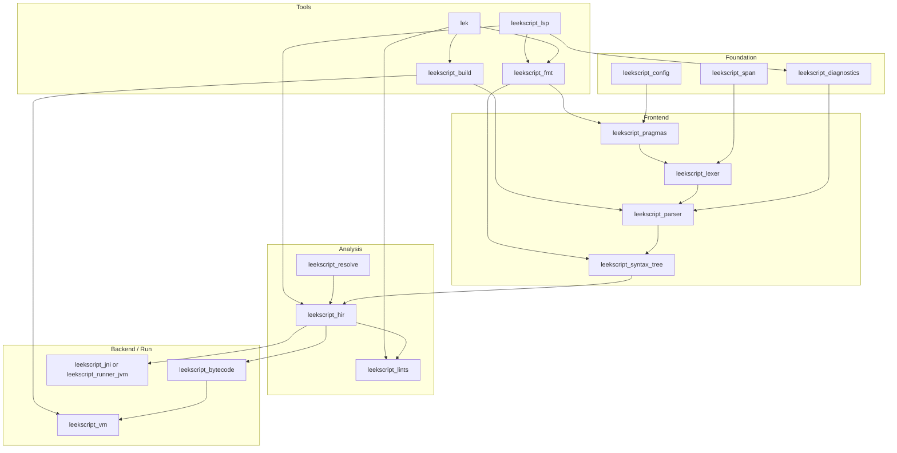

# Rust toolchain: crates and responsibilities

This document describes a **workspace layout** of Rust crates to provide a Cargo-like CLI, parsing, execution, and LSP for LeekScript, aligned with the [language specification](../spec/leekscript-language.md) and the Java reference in `leek-wars-generator/leekscript`.

---

## Goals

1. **`lek` CLI** — Commands such as `fmt`, `check`, `run`, `build`, and later `test`, mirroring common Cargo workflows where sensible.
2. **Parse LeekScript** — Lossless or stable AST, diagnostics, and version-aware lexing.
3. **Run LeekScript** — Executable semantics suitable for local tools and, in the long term, integration with **leek-wars-generator** (e.g. validating generated AI code or sharing a runtime ABI).
4. **LSP** — Completion, hover, go-to-def, diagnostics, and format integration.

Cross-cutting concerns: **standard mode** (Java parity) vs **experimental** features; **source directives** (`// leek-version`, `// leek-fmt`, etc.) applied in a dedicated early pass. Parity strategy: [**parity-testing**](../design/parity-testing.md). MVP scope: [**roadmap/mvp**](../roadmap/mvp.md).

---

## Crate graph (logical)

Crates in **italics** in the diagram are optional paths (JNI vs pure Rust VM).

---

## Foundation crates

| Crate | Role |
|--------|------|
| **`leekscript_span`** | File ids, byte/UTF-8 offsets, line/column, span union for diagnostics. |
| **`leekscript_diagnostics`** | **Dual ids:** reference `Error`-style names for parity + stable **`E…`** codes ([numbering plan](../design/diagnostic-codes.md)); severity, labels, rendering (JSON + human text). |
| **`leekscript_config`** | Workspace and manifest discovery (e.g. `Leek.toml`), merge rules with CLI, file directives, and [local directive stacks](../spec/leekscript-language.md#113-scope-config-file-and-local). |

---

## Frontend crates

| Crate | Role |
|--------|------|
| **`leekscript_pragmas`** | Resolves **config → file → local** directive layers (see spec §11): preamble, `leek-push`/`leek-pop` stacks, and line-scoped allows; produces effective `FileOptions` per span. Runs **before** lexing with the resolved language version. |
| **`leekscript_lexer`** | Version-aware tokenizer matching `LexicalParser` behavior (operators, comments, names; keyword classification can follow). **Implemented** (baseline). |
| **`leekscript_syntax`** | **Implemented:** rowan red–green tree, `LeekSyntaxKind`, flat `SOURCE_FILE` (trivia + lexer tokens). Typed root [`SourceFile`](../../crates/leekscript_syntax/src/ast.rs). Nested grammar nodes as the parser grows. |
| **`leekscript_parser`** | Recursive-descent or Pratt parser producing the CST/AST + error recovery for IDE use. |

---

## Analysis crates

| Crate | Role |
|--------|------|
| **`leekscript_hir`** | Lowered representation (resolved names optional here or in `resolve`). |
| **`leekscript_resolve`** | Includes, symbol tables, scopes (may merge into `hir` initially). |
| **`leekscript_lints`** | Semantic checks, unused variables, type-related warnings, parity with Java analyzer where applicable. |

---

## Backend / execution

| Crate | Role |
|--------|------|
| **`leekscript_bytecode`** | IR opcodes and serialization (if using a Rust VM). |
| **`leekscript_vm`** | Interpreter or VM matching game semantics (operation counting, limits). |
| **`leekscript_runner_jvm`** (optional) | Loads the existing Java compiler/runner for **golden** parity during migration; not required for end users once the VM is complete. |

**Generator integration:** `leek-wars-generator` can depend only on **`leekscript_parser`** + **`leekscript_lints`** for validation, or on **`leekscript_vm`** for offline simulation, depending on product needs.

---

## Build system glue

| Crate | Role |
|--------|------|
| **`leekscript_build`** | Incremental compilation driver: pragma scan → parse → analyze → emit bytecode or delegate; cache keyed by version + strict + experimental flags. |

---

## User-facing tools

| Crate / binary | Role |
|----------------|------|
| **`lek`** (binary) | CLI: `lek fmt`, `lek check`, `lek run`, `lek build`, global and project flags, `--version` / `--strict` overrides. |
| **`leekscript_fmt`** | Pretty-printer driven by `leek-fmt` directives and `Leek.toml`. |
| **`leekscript_lsp`** | `tower-lsp` (or equivalent) server using the same analysis pipeline as `lek check`. |

---

## Suggested workspace `Cargo.toml` layout

- Virtual workspace at the repo root listing all crates above.
- **`lek`** depends on `leekscript_build`, `leekscript_fmt`, `leekscript_lints`, `leekscript_config`.
- **`leekscript_lsp`** depends on `leekscript_hir`, `leekscript_diagnostics`, `leekscript_fmt` (for range formatting).

---

## CLI ↔ directives precedence (recommended)

Matches [spec §11.4](../spec/leekscript-language.md#114-precedence-effective-settings):

1. **CLI** flags (highest)
2. **Innermost** open local region (`leek-push` / `leek-pop` stack), then enclosing regions
3. **File preamble** `// leek-*` directives
4. **Project manifest** (`Leek.toml`)
5. **Built-in defaults** (`LATEST_VERSION`, `strict = false`, no experimental flags)

Language-mode keys (`leek-version`, global strictness) normally ignore local regions unless a directive explicitly allows mid-file overrides.

---

## Testing strategy

- **Lexer/parser:** Snapshot tests against token streams and AST fragments; corpus tests from `leek-wars-generator/leekscript` Java tests where licensing permits.
- **Semantics:** Differential testing against JVM backend when `leekscript_runner_jvm` is enabled.
- **LSP:** Protocol tests with golden `textDocument/formatting` and diagnostic ranges.
